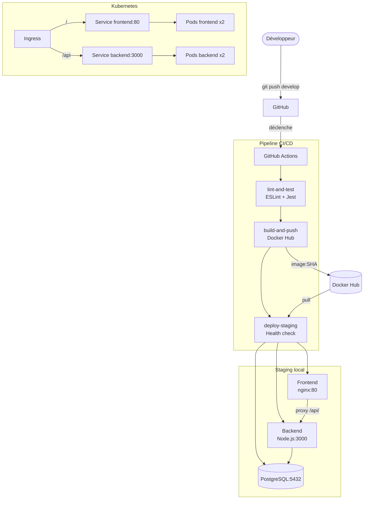

# VitalSync

Application de suivi médical et sportif — projet E6 RNCP39608 Bloc 3.

## Architecture globale



## Prérequis

| Outil           | Version minimale |
|-----------------|-----------------|
| Docker          | >= 24.0         |
| Docker Compose  | >= 2.20         |
| Node.js         | 20 LTS          |
| Git             | >= 2.40         |
| kubectl         | >= 1.28 (K8s)   |

## Lancer le projet en local

```bash
cp .env.example .env
# Modifier .env avec vos valeurs si besoin
docker compose up -d
```

- Frontend : http://localhost:80  
- API health : http://localhost:3000/health

## Pipeline CI/CD

Déclenchement : push sur `develop` ou PR vers `main`.

| Job | Rôle |
|-----|------|
| `lint-and-test` | ESLint + Jest — bloque si erreur |
| `build-and-push` | Build multi-stage, push image taguée avec le SHA du commit |
| `deploy-staging` | Pull l'image SHA, `docker compose up --no-build`, health check avec retry |

## Choix techniques justifiés

### Node.js 20 Alpine
Image LTS légère (~180 MB vs ~1 GB pour l'image standard).  
Alpine supprime les outils de compilation non nécessaires en production.

### Dockerfile multi-stage (backend)
- **Stage `build`** : installe toutes les dépendances (devDependencies incluses), exécute les tests — garantit que l'image n'est construite que si les tests passent.  
- **Stage final** : copie uniquement `server.js` et réinstalle sans `devDependencies` → image de production sans Jest ni ESLint (~60 MB économisés).

### Nginx Alpine (frontend)
Sert les fichiers statiques et proxifie `/api/` vers le backend.  
Découplage propre : le frontend ne connaît pas l'adresse interne du backend.

### GitHub Actions
Intégré nativement à GitHub, pas d'infrastructure CI externe à maintenir.  
Les secrets (`DOCKER_USERNAME`, `DOCKER_TOKEN`) sont chiffrés dans les Settings du repo.

### Tag d'image par SHA de commit
Chaque build produit une image identifiée de façon unique (`monuser/vitalsync-backend:abc1234`).  
Pas de collision entre deux builds, rollback trivial en changeant le tag.

### Kubernetes — 2 réplicas + liveness probe
- 2 réplicas = haute disponibilité sans surcoût.  
- `livenessProbe` sur `/health` : K8s redémarre automatiquement un pod qui ne répond plus.  
- `Secret` K8s pour le mot de passe DB : jamais en clair dans le Deployment.

### PostgreSQL 16 Alpine
Base relationnelle standard, image officielle allégée, volume persistant `db-data`.

## Structure du repo

```
vitalsync/
├── backend/
│   ├── server.js          # API Express (health, vitals, activities)
│   ├── Dockerfile         # Multi-stage : build+test → prod
│   ├── package.json
│   ├── .eslintrc.json
│   ├── .dockerignore
│   └── test/
│       └── health.test.js
├── frontend/
│   ├── index.html
│   ├── nginx.conf
│   └── Dockerfile
├── k8s/
│   ├── deployment.yml     # Backend + Frontend Deployments
│   ├── service.yml        # Services ClusterIP
│   ├── ingress.yml        # Routage / → frontend, /api → backend
│   └── secret.yml         # Mot de passe DB (base64)
├── .github/workflows/
│   └── ci.yml             # Pipeline 3 jobs
├── docker-compose.yml
├── .env.example
├── .gitignore
└── README.md
```
